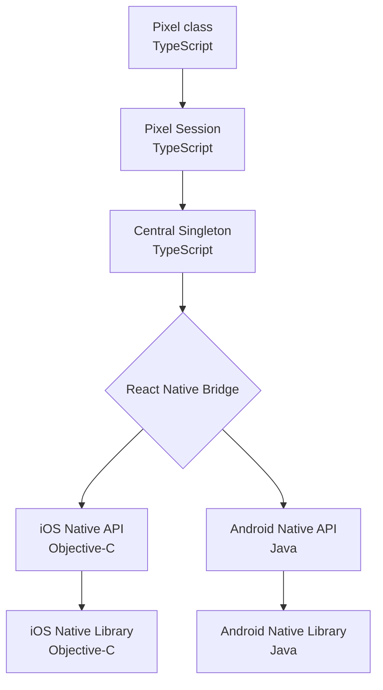
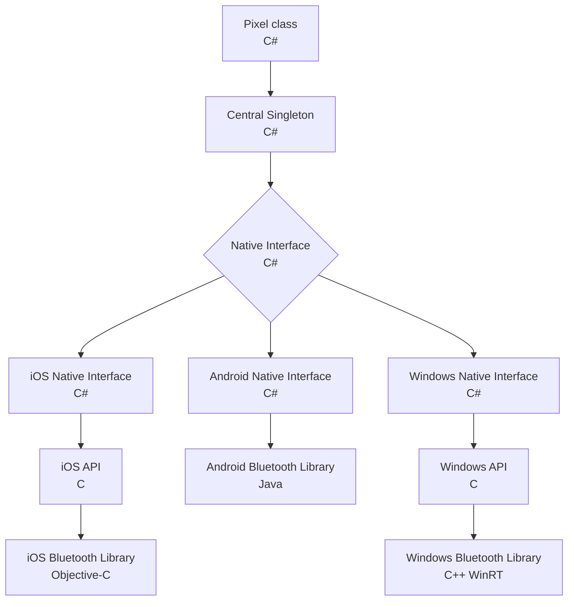
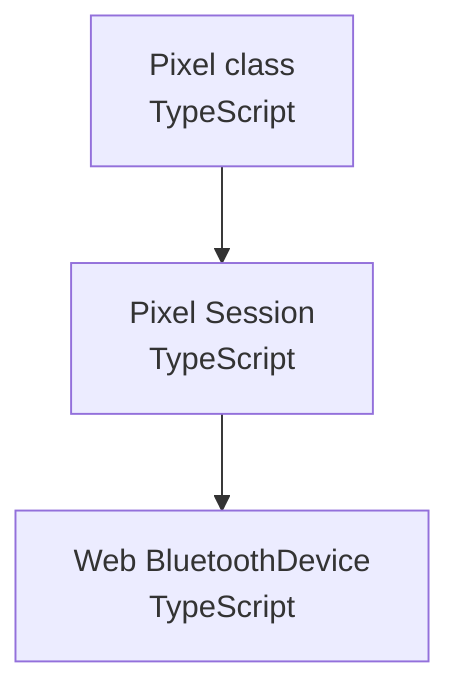
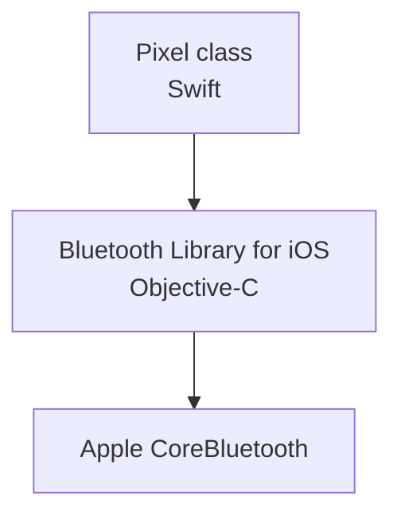
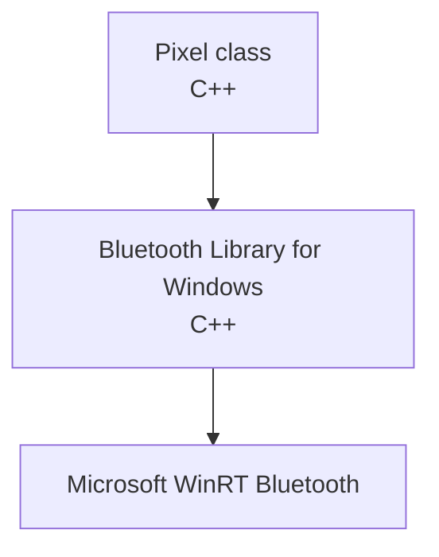
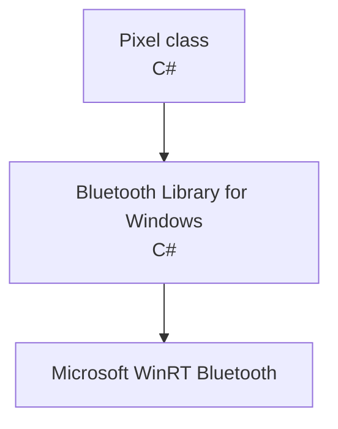
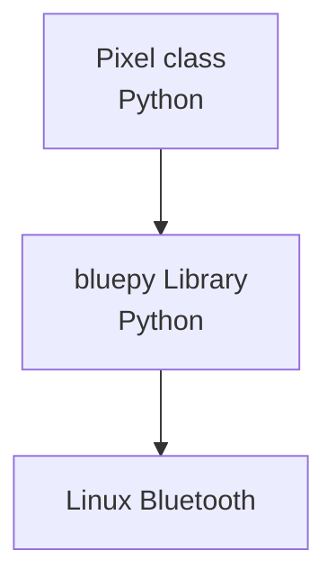

# Pixels Internal Software Architecture

Our libraries support multiple languages and platforms but they still share
a common architecture, and in some cases some common code.

All our libraries have a `Pixel` class that allow connecting to and communicating
with Pixels dice without prior knowledge of the Bluetooth protocol.

The `Pixel` class have properties to access the connection status, roll state,
current face up, RSSI, etc. and methods to query information, make the die blink, etc.
Those methods and properties have similar names across all platforms.

## React Native & Unity Native

The React Native and Unity packages both support Android & iOS (and Windows for Unity)
and both require using native code to access the OS Bluetooth capabilities (neither of
these platform support have direct support for Bluetooth).
They use the same native libraries to access the host OS Bluetooth stack.

They have a singleton named `Central` which act as the common entry point to the different
native Bluetooth implementations.
This singleton presents the Bluetooth feature set in a way that is consistent with the
underlying platform (Unity or React Native in this case).

The `Central` singleton gest access to the native Bluetooth stack through a relatively
simple native API that encapsulates the Bluetooth capabilities of the OS.
This singleton is not specific to Pixels dice and may be used to connect to and communicate
with any Bluetooth peripheral.

As a design choice the `Central` implementation only exposes the common features between iOS
and Android (as well as Windows and MacOS in the future).
In some very specific case we allow for platform specific features but only if they bring
some significant value (example: the peripheral MAC address is only available on Android).

### React Native

The bridge mechanism in React Native allow to have exactly the same native API regardless
of the underlying native language.

The TypeScript implementation of the `Pixel` class works both for React Native and web.
To that effect it is relying on an intermediary `PixelSession` abstract class.
The later has a concrete implementation for web and another one for React Native.

The iOS and Android native libraries encapsulate their respective OS Bluetooth stack
in a similar way.
Among other things it handles queuing BLE requests and notifying of their outcome.
Just as for the `Central` singleton, those native libraries are not specific to Pixels
Bluetooth peripheral.

See our Pixels package for React Native: [*@systemic-games/react-native-pixels-connect*](
    https://github.com/GameWithPixels/pixels-js/tree/main/packages/react-native-pixels-connect
).

### Unity

Due to the design choices of how Unity is supporting native languages, the native libraries are
accessed differently depending of the OS.

To keep the `Central` singleton code free of OS specific code branches, there is another layer in C#:
the abstract `NativeInterface` class.
It has a concrete implementation for each supported native library and exposes the access to the host
OS feature set in a unified manner.

The iOS and Android libraries are the same ones than those used in the React Native package
described previously.

See our Pixels plugin for Unity: [*Pixels Unity Plugin*](
    https://github.com/GameWithPixels/PixelsUnityPlugin 
).

## Web

The web package is using the same `Pixel` and `PixelSession` classes than React Native.

See our Pixels package for web: [*@systemic-games/pixels-web-connect*](
    https://github.com/GameWithPixels/pixels-js/tree/main/packages/pixels-web-connect
).

## Swift

The Swift package is based on the same iOS native library than the one used in the Unity Plugin
and the React Native package described previously.

See our Pixels package for Swift: [*swift-pixels-library*](
    https://github.com/GameWithPixels/swift-pixels-library/
).

## Windows C++

The Windows C++ package is based on the same Windows RT native library than the one used
in the Unity Plugin described previously.

## .NET

> /!\ Not yet published.

The C# `Pixel` class and the C# Windows RT Library are similar to their C++ Windows RT counterparts
Library with some adaptations for the .NET platform.

## Python

> /!\ Out of date version published.

The python package only supports the Raspberry Pi at the moment and is using the [bluepy](
    https://github.com/IanHarvey/bluepy
) library to access to the OS Bluetooth stack.

