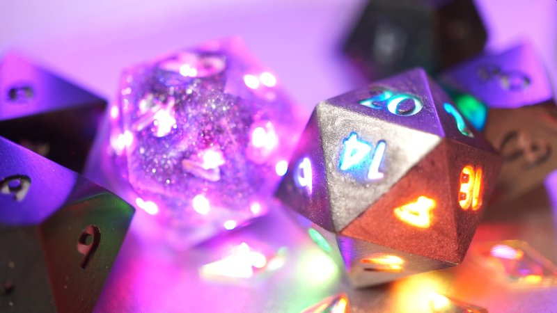
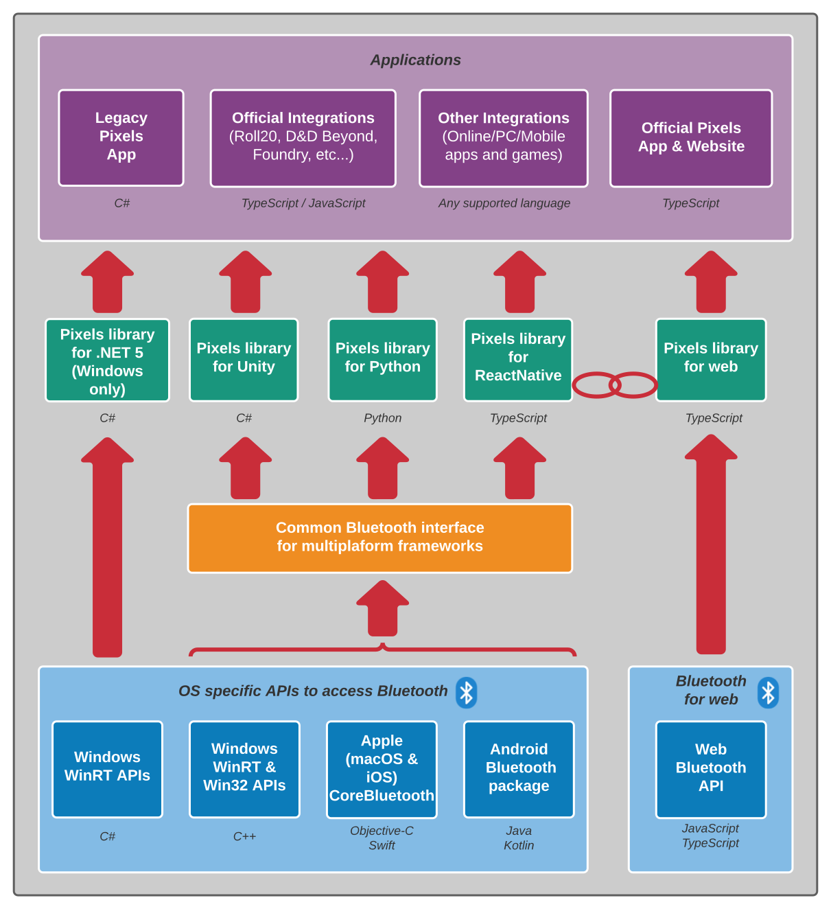
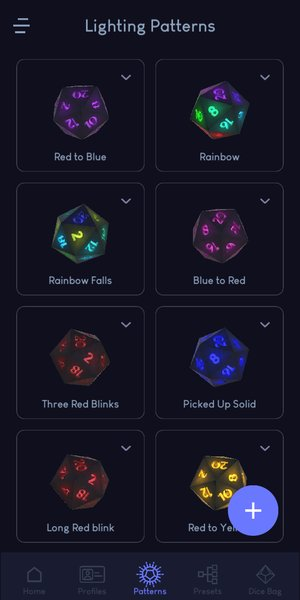
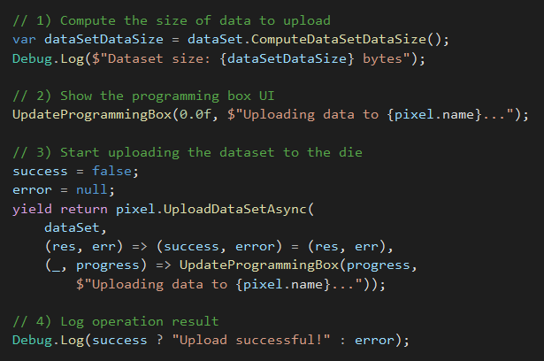
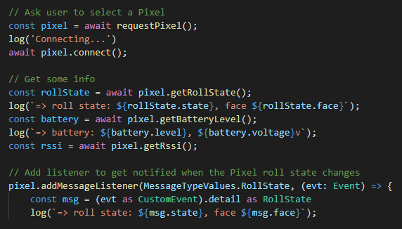
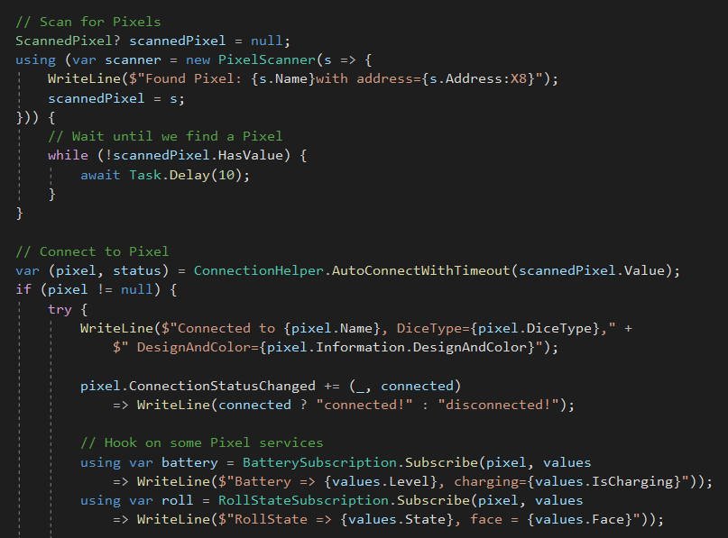

# Welcome!

You are on the landing page for Pixels electronic dice software development!

*Two Pixels dice lighting up with multiple colors.*

Pixels are full of LEDs, smarts and no larger than regular dice, they can be
customized to light up when and how you desire.
Check our [website](https://gamewithpixels.com/) for more info.

GitHub is a website designed to host all kind of software's source code.
We use it to store all the open source projects that we develop for Pixels.

This page is good starting point if you are interested in developing software
that connects to Pixels or if you want to learn more about our
development effort to support Pixels on many platforms and
[frameworks](https://en.wikipedia.org/wiki/Software_framework).

# Software Overview

Pixels software can be grouped in three broad categories:
- Applications
- Libraries
- Firmware

Below is a diagram showing the various applications and libraries for Pixels
(firmware is not shown here).

*Diagram showing the Pixels library for each supported framework (.NET 5, Unity, Python, ReactNative and Web) and how they access Bluetooth APIs depending on the underlying platform (Windows, Apple, Android and Web) and language.*

## Applications

Applications include everything meant for the end user:
- Our iOS & Android app for customizing Pixels
- Future Pixels integrations with virtual tabletop websites
- Parts of our website that *will* have the capabilities to connect to Pixels
- Example applications and web pages that demonstrates how to write software
to use Pixels

### Official Pixels App

*Screenshot of the official Pixels app.*

The *prototype* Pixels app (also known as the *legacy* app) shown during the
[Kickstarter](https://www.kickstarter.com/projects/pixels-dice/pixels-the-electronic-dice)
campaign was developed using the Unity game engine.
At the time this was the fastest way for us for to get the app done.
It was also a good use case to test Pixels integration with a video game engine.

However Unity is better suited for developing video games rather than your
typical mobile app.
We are now in the process of moving the app to
[React Native](https://reactnative.dev/), a JavaScript development framework
designed to build mobile apps for iOS and Android.

The source code for the Unity app is available from the
[PixelsApp](https://github.com/GameWithPixels/PixelsApp)
repository.

We also have published an online
[guide](https://github.com/GameWithPixels/PixelsApp/wiki/Pixels-App-Guide)
for the app that explains how to use the app and customize your Pixels.
It's a good introduction to the terms and concepts we use to describe the dice
various features such as profile, lighting pattern, gradient, LED pattern, etc.

*Note:* development just got started on React Native so we haven't yet published any source code for it.

## Libraries

Any application using Pixels needs to connect to and communicate with the dice.
Those communications happen over Bluetooth Low Energy, an open standard
available on many platforms.

To help integrate Pixels with new or existing software, we are developing
software libraries that provide a straightforward access to the dice features
while taking care of the technicalities of Bluetooth communications.

We provide several implementations of the Pixels library to support a variety
of platforms and frameworks which each have different requirements
(programming language to use, available APIs to access Bluetooth, etc.)

### Unity Plugin

Here is code snippet for Unity showing how to upload an animation to a die:

*Sample code for Unity demonstrating how to upload an animation to a die.*

For games using Pixels, we provide a Unity plugin available from this
[repository](https://github.com/GameWithPixels/PixelsUnityPlugin).
The technical documentation for the "Pixels" class is published
[here](https://gamewithpixels.github.io/PixelsUnityPlugin/class_systemic_1_1_unity_1_1_pixels_1_1_pixel.html).

The plugin currently supports the Windows, iOS and Android
platforms.
It should also work on macOS but we haven't run tests yet.
Linux support will be added at a later time.

### Native platforms

We haven't released any specific package for native development.
The native code from the Unity Plugin can be used as an example
of how to use Bluetooth on the Windows, iOS, macOS and Android platforms.

The native code for those platforms is fully
[documented](https://gamewithpixels.github.io/PixelsUnityPlugin/modules.html).

### Web Package

*Sample code demonstrating how to connect to a die using TypeScript.*

For web developers we've released an early version of the Pixels library
as an NPM [package](https://www.npmjs.com/package/pixels-library).
This TypeScript package is currently in development and will be updated
throughout 2022.
The source code is available on GitHub from this
[repository](https://github.com/GameWithPixels/PixelsWebPackage)
and the technical documentation is published
[here](https://gamewithpixels.github.io/PixelsWebPackage/modules.html).

### React Native

Work with the [React Native](https://reactnative.dev/) development framework
has just started.
Like with Unity, we are aiming to release both a fully featured app
and a standalone package with support for Pixels on several platforms.

The programming language used is TypeScript which allow us to share code
with the Web Package.

We will also be re-using native code from the Unity Plugin which provides
a uniform access to the Bluetooth APIs for Windows, macOS, iOS and Android.

### Python

This is still a work in progress. At the moment interested developer can look
at some early [tests](https://github.com/GameWithPixels/PythonConnect) we did
using the [bluepy](https://github.com/IanHarvey/bluepy) library to connect
to Pixels from a Raspberry Pi.

Just like for the React Native plugin, we plan on re-using the work we did for
the Unity Plugin to provide a multi-platform Bluetooth interface for Python.

# .NET 5 for Windows

We also have run some tests with .NET 5 on Windows, leveraging the WinRT
[APIs](https://docs.microsoft.com/en-us/uwp/api/windows.devices.bluetooth)
to connect to Pixels. We will publish a .NET package later this year.

*Sample code demonstrating how to connect to a die using C#.*

## Firmware

The firmware is a piece of code that runs on a Pixels' chip.
Among other things, it takes care of lighting up the dice as expected and
handles Bluetooth Low Energy communications.

The firmware source code is available from this
[repository](https://github.com/GameWithPixels/DiceFirmware)
and its companion bootloader may be found in this
[one](https://github.com/GameWithPixels/DiceBootloader). 
